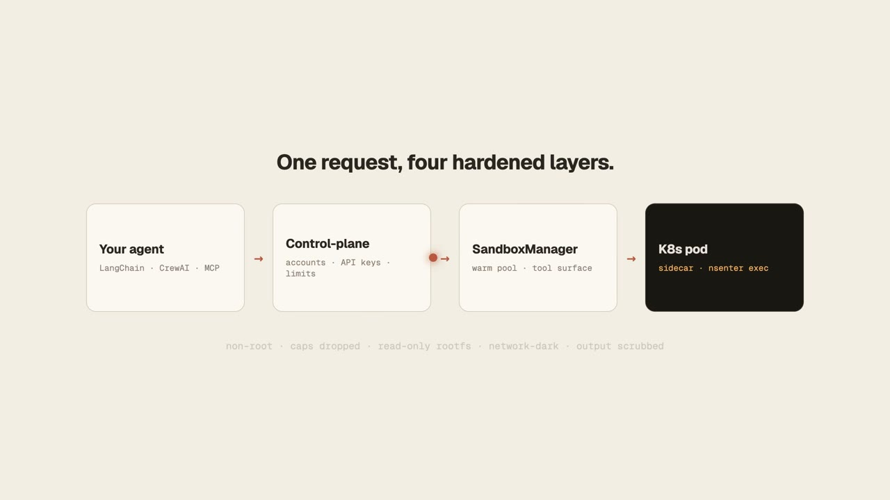

<p align="center">
  
</p>

<h1 align="center">boxkite</h1>

<p align="center">
  <a href="LICENSE"></a>
  <a href="https://github.com/EvAlssment/boxkite/actions/workflows/ci.yml"></a>
  <a href="https://pypi.org/project/boxkite-sandbox/"></a>
  <a href="https://www.npmjs.com/package/boxkite-client"></a>
  <a href="https://pkg.go.dev/github.com/EvAlssment/boxkite/sdk-go"></a>
  <a href="https://crates.io/crates/boxkite-client"></a>
</p>

<p align="center">
  <a href="https://boxkite-site.vercel.app">Website</a> ·
  <a href="#quickstart">Quickstart</a> ·
  <a href="https://boxkite-site.vercel.app/developers">Docs</a> ·
  <a href="#self-hosting">Self-hosting</a> ·
  <a href="#security">Security</a> ·
  <a href="examples/">Examples</a>
</p>

<p align="center">
  <a href="https://boxkite-site.vercel.app" title="Watch the boxkite demo">
    
  </a>
</p>
<p align="center">
  <a href="https://boxkite-site.vercel.app">▶ Watch the demo</a>
</p>

**The missing batteries-included, self-hostable sandbox for agent code execution.**

Most "agent sandbox" projects give you raw isolation — a pod, a VM, a container —
and leave you to build the tool surface an LLM agent actually needs on top of it.
boxkite is the other half: a complete `bash`/`python`/file/search/process tool
surface running inside real Kubernetes pod isolation, self-hostable end to end.
Point your agent framework at it and you have a real sandbox in minutes, on
infrastructure you control.

- **15 framework-agnostic tools** (plus an opt-in 8-tool git set) — LangChain,
  LangGraph, LlamaIndex, CrewAI, AutoGen, the OpenAI Agents SDK, or plain
  function calling, with no required dependency on any of them
- **One Kubernetes pod per session** — non-root, all capabilities dropped,
  read-only root filesystem, network egress denied by default
- **A hosted-API control-plane you run yourself** — accounts, API keys,
  fair-use limits, and client SDKs in four languages, if you want a real
  multi-tenant API in front of the sandbox instead of embedding it directly
- **CLI, MCP server, Helm chart, and a one-click Render deploy** for the
  control-plane — see [Self-hosting](#self-hosting)
- **Nothing held back.** Every piece here — runtime, control-plane, all four
  SDKs, the MCP server — is MIT-licensed and self-hostable; there's no
  separate closed hosted-only tier

**Who this is for:** teams *building their own agent products* that need
isolated, multi-tenant code execution at scale. It's **not** a single-user
local dev-session sandbox like the built-in `bash` tool in an IDE or CLI
coding agent — if you just want your own assistant to run shell commands on
your machine, boxkite is the wrong layer.

## Quickstart

```bash
git clone https://github.com/EvAlssment/boxkite.git boxkite && cd boxkite
pip install -e .          # NOT "pip install boxkite" -- see note below
boxkite up                # builds + starts sandbox, sidecar, and local MinIO
boxkite exec "python3 -c 'print(1 + 1)'"
```

> The PyPI name is `boxkite-sandbox`, not `boxkite` (already taken) — the
> import path (`import boxkite`) and the `boxkite` CLI command are unaffected.

```python
from uuid import uuid4
from boxkite import SandboxManager
from boxkite.tools import create_sandbox_tool_specs

manager = SandboxManager()
session_id = str(uuid4())
await manager.create_session(organization_id=uuid4(), session_id=session_id)

specs = create_sandbox_tool_specs(sandbox_manager=manager, session_id=session_id)
bash_tool = next(s for s in specs if s.name == "bash_tool")
result = await bash_tool.handler(command="echo hello from boxkite")
```

Framework adapters (`boxkite.tools.adapters`) convert the same tool specs for
LangChain, LlamaIndex, the OpenAI Agents SDK, or plain OpenAI/Anthropic/
Gemini/Mistral function-calling schemas — see the
[full integration guide](https://boxkite-site.vercel.app/developers/guides/quickstart)
and [`examples/`](examples/) for a runnable version of every framework.

## Self-hosting

Everything in this repo — including the `control-plane/` hosted multi-tenant
API — is something you deploy yourself:

- **Real Kubernetes** — two steps. First lay down the cluster prerequisites
  (RBAC, NetworkPolicy, pod-security admission policy, ServiceAccount,
  Config/Secret scaffolding) by applying `deploy/rbac.yaml`/
  `network-policy.yaml`/`pod-security-policy.yaml`, or
  `helm install boxkite deploy/helm/boxkite`. This chart does **not** deploy
  the control-plane itself (it has no Deployment/Service) — the per-session
  sandbox pods are created programmatically by the control-plane at runtime.
  Then deploy the `control-plane/` API separately (see the Render button
  below or the [developer docs](https://boxkite-site.vercel.app/developers)).
  A local `kind` cluster works too: `./deploy/local-kind/setup.sh`.
- **One-click Render deploy** for the control-plane API —
  [](https://render.com/deploy?repo=https://github.com/EvAlssment/boxkite)
  (still needs a real Kubernetes cluster for actual sandbox execution).
- **docker-compose**, for local iteration without a cluster — see the
  Quickstart above.

> docker-compose mode shares a PID namespace with the sandbox container and
> execs into it via `nsenter`, the same mechanism the Kubernetes runtime
> uses — it no longer needs (or mounts) the host's Docker socket. See
> [SECURITY.md](SECURITY.md) for the current list of disclosed limitations.

Full walkthroughs for every path above (Kubernetes, Helm, Render, the
`boxkite` CLI's hosted mode, secrets, webhooks, MCP, and every SDK) live on
the [developer docs site](https://boxkite-site.vercel.app/developers).

## What's in this repo

One repo, several independently-versioned pieces, kept together deliberately
(see [CONTRIBUTING.md](CONTRIBUTING.md)):

| Piece | What it is |
|---|---|
| `src/boxkite/` (`boxkite-sandbox` on PyPI) | The core: `SandboxManager`, `WarmPoolManager`, and the 15+ tool `boxkite.tools` surface. Embed this directly against your own cluster. |
| `sidecar/` | The FastAPI service that runs in every sandbox pod — filesystem I/O, command exec via `nsenter`, storage sync. |
| `control-plane/` | Optional hosted-API layer in front of `SandboxManager` — accounts, API keys, fair-use limits. |
| `sdk-python/`, `sdk-js/`, `sdk-go/`, `sdk-rust/` | Thin HTTP clients for *your own* running control-plane. |
| `mcp-server/` (`boxkite-mcp`) | Wraps the Python SDK as an MCP tool source for Claude Code, Claude Desktop, Codex, or Cursor. |
| `handoff-cli/` (`boxkite-handoff`) | Moves an in-progress local Claude Code/Codex CLI/opencode session into a fresh sandbox, full conversation history included — see [docs/handoff-adapters.md](docs/handoff-adapters.md). Not yet published. |
| `bastion/` | Standalone SSH server bridging into a session's human-takeover WebSocket. |
| `deploy/` | Kubernetes manifests, Helm chart, Dockerfiles, docker-compose, Render Blueprint. |
| `examples/` | Runnable cookbook — LangGraph, LangChain, raw HTTP, OpenAI/Gemini/Mistral function calling, and more. |

## Security

boxkite executes arbitrary, agent-generated code — its security posture is
layered defense in depth: a per-pod shared-secret sidecar auth token, a
fresh empty network namespace on every `exec` call, non-root execution with
every Linux capability dropped, and a read-only root filesystem. No single
one of these is meant to stand alone.

See [SECURITY.md](SECURITY.md) for the full model, known limitations, and
how to report a vulnerability privately — this project runs arbitrary code,
so a sandbox-escape report deserves a fast, private path, not a public
issue. The [security model guide](https://boxkite-site.vercel.app/developers/guides/security-model)
covers the same ground with runnable examples.

## Published packages and images

| Package | Registry |
|---|---|
| `boxkite-sandbox` | [PyPI](https://pypi.org/project/boxkite-sandbox/) |
| `boxkite-client` (Python) | [PyPI](https://pypi.org/project/boxkite-client/) |
| `boxkite-client` (JS/TS) | [npm](https://www.npmjs.com/package/boxkite-client) |
| `boxkite-mcp` | [PyPI](https://pypi.org/project/boxkite-mcp/) |
| `boxkite-client` (Go) | [pkg.go.dev](https://pkg.go.dev/github.com/EvAlssment/boxkite/sdk-go) |
| `boxkite-client` (Rust) | [crates.io](https://crates.io/crates/boxkite-client) |

## License

[MIT](LICENSE) — fully permissive. Use, modify, self-host, or build a
competing hosted service on top of boxkite; there's no restriction.

## Contributing

See [CONTRIBUTING.md](CONTRIBUTING.md) — we use the Developer Certificate of
Origin (`git commit -s`), not a CLA.
