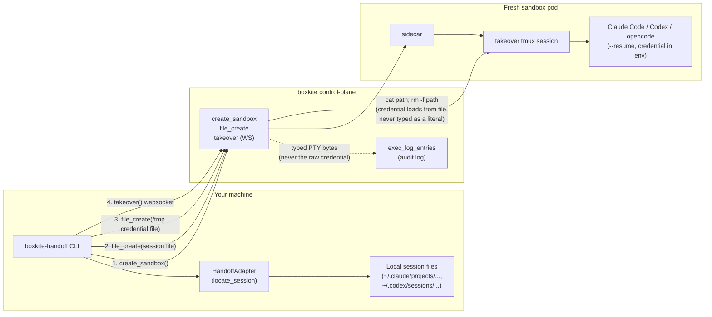

# Handoff adapters: moving a local coding-agent session into a boxkite sandbox

`boxkite-handoff` lets someone running Claude Code, Codex CLI, opencode, or
Cursor locally move their **in-progress, full-history conversation** into a
fresh boxkite sandbox and keep interacting with it from there — the CLI
keeps running under the user's own (portable, scoped) credential, not a
copy of their laptop's raw login session.

This doc defines the adapter contract so new tools can be added without
touching the shared orchestration code, and records the architecture
decisions so a future contributor doesn't have to re-derive them.

## Non-goals

- **Not a task/diff handoff.** GitHub Copilot CLI's `/delegate` (transfer a
  git diff + task description to a cloud agent that reasons about it fresh)
  is a different, easier feature. This is full conversational continuity —
  the receiving CLI process resumes the exact same session, not a summary
  of it. Where a tool genuinely has no locally-resumable session state, it
  is out of scope until the tool adds one — degrade honestly, don't fake it
  with a diff-based approximation.
- **Not a warm pool.** Every handoff provisions a fresh sandbox
  (`create_sandbox`). No pre-warmed standing capacity.
- **Not a new sidecar/control-plane surface**, at least for v1 — see
  "Architecture" below for why the existing primitives are enough.

## Architecture: no new server-side surface needed

`boxkite-client` already exposes everything this needs:

1. `create_sandbox(...)` — fresh sandbox, same as any other boxkite session.
2. `file_create(session_id, path, content)` — push the local session file(s)
   into the sandbox at the path the tool's own resume mechanism expects.
3. `takeover(session_id)` — opens the **same PTY websocket the human-takeover
   terminal already uses** (`docs/AGENT-PTY-DESIGN.md`,
   `docs/SANDBOX-OBSERVABILITY-DESIGN.md`; the tmux-backed channel hardened
   against sandbox-side access in GitHub issues #130/#144).

The handoff orchestrator (`orchestrator.py`) connects to that same takeover
channel and *types* into it — `unset HISTFILE`, a credential-loading line
(see below — **not** the raw value), `cd <workdir>`, then the tool's resume
command. From that point the connection is indistinguishable from an
ordinary takeover session, so it hands off directly to a local terminal
passthrough (or the existing `/dashboard/session` browser terminal).

This is deliberate, not a shortcut: it means a first working version
requires zero changes to `sidecar/` or `control-plane/`.



Step by step, in order:

```mermaid
sequenceDiagram
    participant U as You (terminal)
    participant A as HandoffAdapter
    participant O as orchestrator.py
    participant CP as control-plane
    participant SB as Sandbox pod

    U->>A: boxkite-handoff claude-code
    A->>A: locate local session file +\nportable credential (setup-token, etc.)
    A-->>O: LocatedSession
    O->>CP: create_sandbox()
    CP-->>O: sandbox_id
    O->>CP: file_create(session file)
    CP->>SB: write to /workspace/...
    O->>CP: file_create(/tmp/.boxkite-handoff-credential-*)
    CP->>SB: write to /tmp (never /workspace)
    O->>CP: takeover(sandbox_id)  [WS]
    CP->>SB: attach to takeover tmux session
    O->>SB: types: unset HISTFILE
    O->>SB: types: export VAR="$(cat path)"; rm -f path
    O->>SB: types: cd <workdir>
    O->>SB: types: claude --resume <id>
    SB-->>U: full conversation resumes, live terminal
```

## Security-review incident: the first version of this typed the raw credential, which was wrong

The first version of this doc claimed the takeover channel was safe to
type a raw credential value into, reasoning that it's "isolated from the
sandboxed workload's own namespace" (true, per issues #130/#144). A
security review caught that this reasoning addressed the wrong threat
model: `takeover()` connects through the **control-plane**, not directly
to the sidecar, and the control-plane mirrors every byte typed on that
channel into the `exec_log_entries` audit table
(`_relay_client_to_sidecar` / `_periodic_typed_snapshot_flush` in
`control-plane/src/control_plane/routers/sandboxes.py`) — durably, in
plaintext, unconditionally, with no redaction on that path (unlike the
separate, opt-in asciicast recording feature, which does run a
best-effort redaction pass). That table is later readable by any API key
on the account via `GET /v1/sandboxes/{id}/log`, and fanned out to any
configured audit-log webhook. None of that is a bug — it's the intended,
already-documented behavior of the human-takeover accountability
feature — it's just incompatible with also typing a real, long-lived
credential through the same channel every single time a handoff runs.

**The fix**: the credential's raw value is pushed via `file_create`
instead of typed. Control-plane's own audit entry for `file_create`
records only `{"path": ...}`, never `content`
(`create_file_in_sandbox` in `routers/sandboxes.py`) — so the value never
reaches the audit log this way. Only a `cat <path> && rm -f <path>`
reference is typed into the PTY (a path, generated by `orchestrator.py`
itself, never the secret), so the takeover-logging problem doesn't apply
to it. The file lands under `/tmp` (not `/workspace`, which syncs to
durable storage) and is deleted by the same typed line that reads it, so
it exists sandbox-side only for the brief window between the
`file_create` call and the `cat`. That residual window is a smaller,
already-accepted risk: anything with the sandbox's own UID can already
reach a running process's environment via `/proc`, so a same-uid process
reading a same-uid temp file first isn't a materially different trust
boundary — durably logging the value to a cross-account-readable,
webhook-fanned-out audit table was the actual, much larger problem.

## Credential handling — the rule that matters

**Always use the tool's own portable, scoped, revocable credential —
never the raw local OAuth session / browser cookie / keychain entry.**
Concretely:

| Tool | Portable credential |
|---|---|
| Claude Code | `claude setup-token` → `CLAUDE_CODE_OAUTH_TOKEN` (model-requests-only scope, ~1yr, independently revocable) |
| Codex CLI | `OPENAI_API_KEY`, or Codex's own portable auth file if using a ChatGPT-plan login |
| opencode | provider API key from `~/.local/share/opencode/auth.json` |
| Cursor | `CURSOR_API_KEY` |

Why this is safe to authenticate with in the sandbox at all: this
credential authenticates the CLI process itself — the same process that
would otherwise need it in its own local environment. There's no way to
keep it out of that process's env and still have it authenticate. The
requirements that follow from that:

- The raw value is pushed via `file_create` under `/tmp`, never typed
  directly into the takeover channel and never written under `/workspace`
  (see the incident writeup above for why both matter).
- `unset HISTFILE` before the credential-loading line, so it also never
  lands in a shell history file that could persist or get synced.
- The temp credential file is deleted by the same command that reads it.

Do **not** route this credential through `create_sandbox(secret_names=...)`
or the sidecar's `{{secret:name}}` HTTP broker — that mechanism exists for
a different trust boundary (handing a third-party API key to a
semi-trusted, prompt-injectable *agent* workload without the workload ever
holding the raw value). Here the CLI *is* the trusted operator's own tool,
not the thing being brokered against.

## Session/resume-command identifiers must be validated before use

A second security-review finding: `orchestrator.py` types
`resume_command` into the takeover shell **unquoted** (it has to be — it's
a real command line, not a single argument), which means any adapter that
builds `resume_command` from an unvalidated, locally-discovered
identifier (e.g. "whichever session file has the newest mtime") creates a
command-injection path if that identifier were ever attacker-influenced
(a compromised local machine planting a maliciously-named session file).
Every adapter must run any locally-discovered session id through
`core.validate_identifier()` before embedding it in `resume_command` —
see `claude_code.py`, `codex.py`, and `opencode.py` for the pattern.

## The `HandoffAdapter` contract

See `public/handoff-cli/src/boxkite_handoff/core.py`. One adapter per tool,
each providing a single `locate_session(session_ref=None)` call that
returns a `LocatedSession`:

- `session_id` — the tool's own session/thread identifier.
- `files` — every local file that must exist at the same (or an
  adapter-computed) path inside the sandbox for `--resume`-style
  continuation to find it. Adapters decide their own path-mapping — e.g.
  Claude Code's resume is cwd-sensitive, so its adapter also has to
  reproduce enough of the original working directory's structure that the
  encoded-path lookup lines up; Codex's `-c experimental_resume=<path>`
  takes an arbitrary path, so no such mapping is needed.
- `credential` — the portable credential to export (see table above).
- `resume_command` / `workdir` — the exact command and cwd the takeover
  shell should run.

All local-filesystem/session-format knowledge lives in the adapter. All
sandbox-provisioning/file-push/terminal-streaming logic lives once in
`orchestrator.py` and is never duplicated per adapter.

## Adding a new adapter

This is meant to be community-extensible — that's the actual answer to
"support nearly every tool people use" without an unbounded internal
backlog. To add one:

1. Confirm the tool actually persists a locally-resumable session (a file
   or an API a client can point at) — if it only supports "start fresh and
   describe the task," it doesn't fit this contract; that's a different
   feature.
2. Implement `HandoffAdapter` in `boxkite_handoff/adapters/<tool>.py`,
   returning a `LocatedSession`.
3. Register it in `boxkite_handoff/adapters/__init__.py`'s `ADAPTERS` dict.
4. Add unit tests covering locate-session logic against a fixture session
   file/directory — no live sandbox or network call should be needed to
   test an adapter.
5. Document the tool's portable-credential mechanism in the table above —
   if the tool has no such mechanism (only interactive/device-flow login
   with no scriptable, revocable token), say so explicitly in the
   adapter's own docstring rather than silently downgrading to a less safe
   credential.
6. Run every locally-discovered session identifier through
   `core.validate_identifier()` before it's embedded in `resume_command` —
   see "Session/resume-command identifiers must be validated before use"
   above.

## Current adapter status

| Tool | Status | Notes |
|---|---|---|
| Claude Code | reference adapter | JSONL under `~/.claude/projects/<encoded-cwd>/`, cwd-sensitive resume |
| Codex CLI | reference adapter | JSONL rollout under `~/.codex/sessions/`, path-based resume (not cwd-sensitive) |
| opencode | reference adapter | client/server split — may attach live instead of a file push; see the adapter's own docstring for which path it took |
| Cursor | stub -- always raises `HandoffError` | verified directly against the shipped `cursor-agent` binary that its local resume mechanism is backed by an IDE-shared `state.vscdb` store, not a portable per-session file this adapter could confidently copy; see the adapter's own docstring for the full verification record and what it would take to implement this for real |
